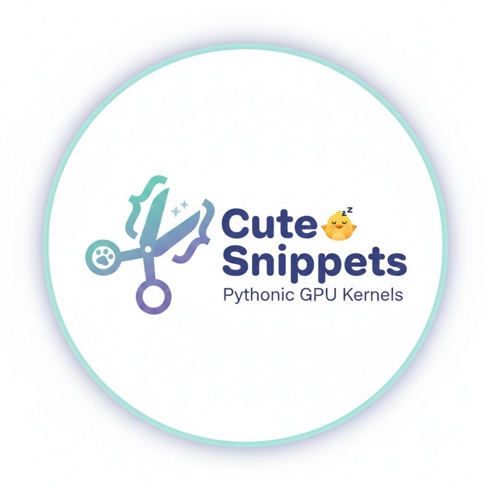
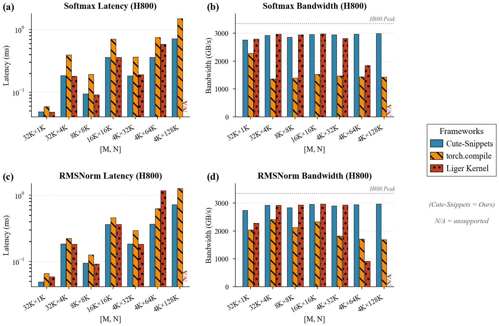

<div align="center">
  

  <h1>Cute-Snippets</h1>

  <p>
    <strong>High-Performance CUDA Kernels with Pythonic Abstractions</strong>
  </p>

  <p>
    <a href="https://github.com/NVIDIA/cutlass"></a>
    <a href="https://www.python.org/"></a>
    <a href="https://developer.nvidia.com/cuda-toolkit"></a>
    <a href="LICENSE"></a>
  </p>

  <p>
    <a href="#-features">Features</a> •
    <a href="#-quick-start">Quick Start</a> •
    <a href="#-documentation">Documentation</a> •
    <a href="#-benchmarks">Benchmarks</a>
  </p>
</div>

---

## 📖 Introduction

**Cute-Snippets** is a collection of high-performance CUDA kernels and abstractions built on top of **CuTe DSL** (Python bindings for NVIDIA's CuTe). It bridges the gap between raw CUDA/C++ performance and Python's ease of use.

This project draws significant inspiration from **[quack](https://github.com/KuangjuX/quack/tree/main)** (A Quirky Assortment of CuTe Kernels), adopting its philosophy of "Pythonic CUDA" while introducing the **HTile** abstraction layer.

At its core is **HTile** (Hardware-Aware Tile Primitives), a framework inspired by **TileFusion** that separates memory hierarchy traversal from kernel computation. This allows developers to write complex, optimized kernels (like RMSNorm, Softmax, and Attention) with significantly less boilerplate.

## ✨ Features

- **🛡️ HTile Abstraction**: A powerful layer for managing Global → Shared → Register memory pipelines.
  - **`ElementwiseKernelContext`**: Automates tile setup, predication, and synchronization.
  - **`ElementwiseLoader` / `Storer`**: Standardized, async-aware data movement primitives.
- **⚡ Optimized Kernels**: Production-ready implementations of:
  - **RMSNorm**: Fused residual, weight/bias, and mixed-precision support.
  - **Softmax**: Efficient row-wise reduction and scaling.
- **🏗️ Hopper Ready**: Built with NVIDIA Hopper (SM90) features in mind, including **Thread Block Clusters** and **TMA** (Tensor Memory Accelerator) concepts.
- **🐍 Pure Python**: Write CUDA kernels entirely in Python using CuTe DSL, with seamless PyTorch integration.

## 🚀 Quick Start

### Prerequisites

- NVIDIA GPU (Ampere, Hopper, or newer)
- CUDA Toolkit 12.0+
- Python 3.10+

### Installation

```bash
# Clone the repository
git clone https://github.com/yourusername/Cute-Snippets.git
cd Cute-Snippets

# Install in editable mode
pip install -e .
```

### Running a Kernel

You can run the provided benchmarks to see the performance:

```bash
# Run RMSNorm benchmark
python benchmarks/benchmark_rmsnorm.py

# Run Softmax benchmark
python benchmarks/benchmark_softmax.py
```

## 📚 Documentation

We believe in clear, comprehensive documentation.

- **[Design Philosophy](docs/design.md)**: Learn about HTile, the separation of concerns, and the core architecture.
- **[RMSNorm Implementation](docs/kernels/rmsnorm.md)**: Deep dive into the RMSNorm kernel, including math and optimizations.
- **[Softmax Implementation](docs/kernels/softmax.md)**: Understanding the Softmax kernel.

## 📂 Repository Structure

```
Cute-Snippets/
├── htile/              # Core framework (Hardware-Aware Tile Primitives)
│   ├── dataflow.py     # Loader, Storer, and Kernel Context
│   ├── config.py       # Tile configuration and layout
│   └── compute/        # Reduction and math primitives
├── kernels/            # Optimized kernel implementations
│   ├── rmsnorm.py      # RMSNorm kernel
│   └── softmax.py      # Softmax kernel
├── benchmarks/         # Performance benchmarks
├── docs/               # Documentation and design notes
└── tests/              # Unit tests
```

## 📊 Benchmarks

All benchmarks run on NVIDIA H800 GPU with `dtype=float16`.

### RMSNorm

| [M, N] | Ours (ms / GB/s) | torch.compile (ms / GB/s) | Liger Kernel (ms / GB/s) |
|--------|-------------------|---------------------------|--------------------------|
| [32768, 256] | 0.025 / 1355 | 0.025 / 1343 | 0.057 / 590 |
| [32768, 1024] | 0.049 / 2743 | 0.066 / 2043 | 0.059 / 2280 |
| [32768, 4096] | 0.183 / 2928 | 0.223 / 2411 | 0.183 / 2934 |
| [16384, 8192] | 0.184 / 2921 | 0.244 / 2204 | 0.182 / 2945 |
| [8192, 16384] | 0.184 / 2924 | 0.237 / 2269 | 0.183 / 2933 |
| [4096, 65536] | 0.365 / 2946 | 0.627 / 1713 | 1.174 / 915 |
| [4096, 131072] | 0.723 / 2969 | 1.265 / 1698 | ❌ Unsupported |

### Softmax

| [M, N] | Ours (ms / GB/s) | torch.compile (ms / GB/s) | Liger Kernel (ms / GB/s) |
|--------|-------------------|---------------------------|--------------------------|
| [32768, 1024] | 0.049 / 2765 | 0.059 / 2283 | 0.048 / 2799 |
| [32768, 4096] | 0.183 / 2930 | 0.394 / 1362 | 0.180 / 2976 |
| [16384, 8192] | 0.184 / 2920 | 0.378 / 1422 | 0.180 / 2982 |
| [8192, 16384] | 0.183 / 2936 | 0.358 / 1501 | 0.179 / 3007 |
| [4096, 65536] | 0.362 / 2968 | 0.745 / 1441 | 0.582 / 1847 |
| [4096, 131072] | 0.717 / 2996 | 1.499 / 1432 | ❌ Unsupported |

**Performance Evaluation (H800 GPU):**

<div align="center">
  
</div>

**Highlights:**
- **~2900 GB/s** sustained bandwidth across all shapes, approaching H800's theoretical HBM bandwidth.
- **1.2×–1.9× faster** than `torch.compile` for RMSNorm; **1.2×–2.7× faster** for Softmax.
- **3× faster** than Liger Kernel (Triton) for large N (≥ 65K) thanks to Hopper cluster support.
- Scales smoothly from N=256 to N=131K — Triton-based kernels fail at N=131K.

## 🤝 Contributing

Contributions are welcome! Whether it's a new kernel, a bug fix, or a documentation improvement, please feel free to open an issue or submit a Pull Request.

1. Fork the repository.
2. Create your feature branch (`git checkout -b feature/amazing-kernel`).
3. Commit your changes.
4. Push to the branch.
5. Open a Pull Request.

## 📄 License

This project is licensed under the MIT License - see the [LICENSE](LICENSE) file for details.
