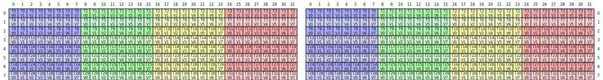
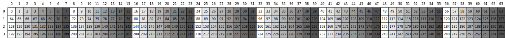
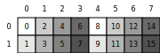

# Softmax Kernel

This document details the implementation of the Softmax kernel using the HTile framework, including the underlying CuTe layout mechanics and performance evaluation.

## Overview

Softmax is a fundamental operation in Transformer architectures, used in attention mechanisms to convert logits into probability distributions. The kernel computes row-wise softmax along the last dimension:

\[
\text{Softmax}(x_i) = \frac{e^{x_i - \max(x)}}{\sum_j e^{x_j - \max(x)}}
\]

This implementation is adapted from the optimized kernels in **[quack](https://github.com/KuangjuX/quack/tree/main)**, refactored to use HTile's composable abstractions.

---

## Architecture: HTile Integration

The Softmax kernel is the canonical example of HTile's separation of concerns. The entire kernel setup (memory allocation, partitioning, predication, synchronization) is handled by `ElementwiseKernelContext`, leaving the kernel to focus purely on the softmax algorithm.

### Host Side (`@cute.jit __call__`)

```python
@cute.jit
def __call__(self, mX, mO, stream):
    # Compute vectorization and tiling parameters
    largest_dtype_width = const_expr(max(t.element_type.width for t in (mX, mO)))
    vec_size = 128 // largest_dtype_width
    tiled_copy = self.config.make_vector_copy(vec_size).tiled_copy_2d()
    tiler_mn = (num_threads // threads_per_row, vec_size * threads_per_row * num_block_N)

    # Launch kernel with auto-configured grid/block/cluster
    self.kernel(mX, mO, tiler_mn, tiled_copy, threads_per_row).launch(
        grid=[ceil_div(M, tiler_mn[0]), cluster_n, 1],
        block=[num_threads, 1, 1],
        cluster=[1, cluster_n, 1] if cluster_n > 1 else None,
        stream=stream,
    )
```

### Device Side (`@cute.kernel`)

```python
@cute.kernel
def kernel(self, mX, mO, tiler_mn, tiled_copy, threads_per_row):
    # ── Common infrastructure (handled by HTile) ──
    ctx = ElementwiseKernelContext(self.config)
    ctx.setup(mX, tiler_mn, tiled_copy)
    gO = ctx.partition_global(mO, tiler_mn)
    tXgO = ctx.partition_dest(gO)
    tXrO = ctx.make_fragment(tXgO)

    # ── Load: G → S → R ──
    ctx.load_to_smem_and_regs()

    # ── Fill OOB with -inf (softmax-specific) ──
    if const_expr(not is_even_N):
        fill_oob(ctx.tXsX, ctx.tXpX, -ctx.sX.element_type.inf)
        cute.autovec_copy(ctx.tXsX, ctx.tXrX)  # Reload corrected smem

    # ── Compute: max → exp → sum → normalize ──
    x = ctx.tXrX.load().to(cute.Float32)
    max_x = row_reduce(x, MAX, ...)
    exp_x = exp2(x * log2_e - max_x * log2_e, fastmath=True)
    denom = row_reduce(exp_x, ADD, ...)
    y = exp_x * rcp_approx(denom)

    # ── Store: R → G ──
    tXrO.store(y.to(tXrO.element_type))
    ctx.store_from_regs(tXrO, tXgO)
```

---

## Technical Deep Dive: Tensor Layouts and Boundary Handling

<p align="center">
  
</p>

### 1. Hierarchical Layout Decomposition

A `TiledCopy` partitions the global coordinate tensor into a local layout \( tXcX \) structured as `((V, M), 1, K)`:

- **Mode 0: `(V, M)` (Atom & Intra-Tile Rows):**
  - **V (Vectorized Atom):** Represents hardware-contiguous elements (e.g., 8 elements for a 128-bit load of fp16). These are handled as a single unit by `cp.async`.
  - **M (Row Iteration):** Represents additional rows assigned to the same thread for better instruction-level parallelism.

- **Mode 1: `(1)` (N-Atom Placeholder):** Indicates the Copy Atom width aligns with the thread's local territory.

- **Mode 2: `(K)` (Global Strided Iteration):** Represents the strided "jumps" a thread makes to cover the full width \( N \) of the Tile.

### 2. The `predicate_k` Strategy

To handle matrices where width \( N \) is not a multiple of the Tile width, a **Predicate Tensor** is generated to mask out-of-bounds accesses.

**Stride-0 Broadcasting and Vector Skipping:**

The `predicate_k` function (in `htile/copy/vector.py`) optimizes register usage through two key techniques:

1. **Vector Skipping:** By using `mode=[0, 1]`, the algorithm ignores the inner vectorization dimension \( V \). Since all elements in a 128-bit load cross the boundary together, only one bit is needed per vector.

2. **Row Broadcasting:** By setting the \( M \) dimension stride to 0, the column-boundary check is applied to every row handled by the thread without consuming extra register space.

### 3. Predicate Tensor Layout Visualization

The predicate tensor `tApA` is created with a layout that efficiently represents boundary checks for vectorized memory accesses:

<p align="center">
  
</p>

**Understanding the Visualization:**

The visualization shows a 2D layout of the predicate tensor `tApA` with shape `(rows, cols)` where:

- **Rows (Vertical dimension):** Represent different vectorized groups or row iterations.
  - Each row corresponds to a different vectorized group or row iteration handled by the thread.
  - The number of rows = `size_mode[0,1] * size_mode[1]`, representing different vectorization groups.

- **Columns (Horizontal dimension):** Represent the K dimension (matrix column direction).
  - Each column corresponds to a vectorized group's position in the K dimension.
  - The number of columns = `size_mode[2]`, representing the number of vectorized groups needed to cover the tile width.
  - Each cell contains a boolean predicate value that controls whether the corresponding vectorized memory access is valid (within matrix boundary \( N \)).

**Layout Structure:**

The `tApA` layout is created with:
- **Shape:** `(size_mode[0,1], size_mode[1], size_mode[2])`
- **Stride:** `(size_mode[2], 0, 1)`

The stride pattern `(size_mode[2], 0, 1)` enables:
- **Vector Skipping** (`stride[0] = size_mode[2]`): One predicate value per vectorized group, skipping the inner vectorization dimension.
- **Row Broadcasting** (`stride[1] = 0`): All rows share the same predicate values, saving register space since column boundaries are the same for all rows.
- **Sequential K Access** (`stride[2] = 1`): Sequential access along the K dimension for efficient iteration.

### 4. OOB Handling: `fill_oob`

After `cp.async` loads data into shared memory, out-of-bounds positions are automatically filled with **0** by the hardware. However, for softmax correctness, these must be replaced with **\(-\infty\)**:

- \( e^{-\infty} = 0 \): OOB elements contribute nothing to the sum.
- \( \max(x, -\infty) = x \): OOB elements don't affect the max.

The `fill_oob` function iterates over the predicate tensor and writes `-inf` to smem positions where the predicate is `False`.

---

## Reduction Buffer Layout and Memory Mapping

The **Reduction Buffer** serves as a high-speed scratchpad in shared memory for inter-warp and inter-block data exchange. It is primarily used during the row-reduction phase to synchronize partial results (`max_x` and `sum_exp_x`) across different execution units.

<p align="center">
  
</p>

The buffer's physical organization is computed by `ReduceLayout` based on the thread configuration and cluster size.

The resulting layout is a 3D structure optimized for bank-conflict-free access and coalesced writes:

- **Dimension 0:** `num_warps // warps_per_row` **(Logical Rows)**
  - Represents the number of independent rows being processed concurrently within a single Thread Block.

- **Dimension 1:** `(warps_per_row, cluster_n)` **(Reduction Peers)**
  - `warps_per_row`: Stores partial results from different warps working on the same row.
  - `cluster_n`: Allocates space for cross-block synchronization when using SM90+ Cluster features (Distributed Shared Memory).

- **Dimension 2:** `stage` **(Pipeline Stages)**
  - For standard Softmax: `stage=2` (one for Max, one for Sum).
  - For Online Softmax: `stage=1` (fused max+sum pair).

The physical memory mapping uses order `(1, 0, 2)`:

- **Coalesced Access:** The reduction peer dimension (mode 1) is the fastest-changing dimension, ensuring that when multiple warps write their partial results simultaneously, the accesses are coalesced and bank conflicts are minimized.
- **Logical Isolation:** Stage-wise data (mode 2) is the slowest-changing dimension, ensuring clear separation between the Max and Sum reduction phases.

```
[ Logical Matrix Row ]
      |
      +--- Processed by [Warp 0, Warp 1, ..., Warp N]
                              |
                              V
[ Reduction Buffer (Smem) ]
+-------------------------------------------------------------+
| Stage 0 (Max) | Row 0: [W0_res][W1_res]...[Wn_res]          | <-- Physical Order (1, 0)
|               | Row 1: [W0_res][W1_res]...[Wn_res]          |
+-------------------------------------------------------------+
| Stage 1 (Sum) | Row 0: [W0_res][W1_res]...[Wn_res]          |
|               | Row 1: [W0_res][W1_res]...[Wn_res]          |
+-------------------------------------------------------------+
```

This structured layout allows the `block_reduce` and `cluster_reduce` functions to perform final aggregations using optimized warp-shuffle instructions after a single synchronized shared memory load.

---

## Softmax Dataflow

The complete dataflow for the non-online softmax path:

```
┌─────────────────────────────────────────────────────────────┐
│  1. Load: Global → Shared → Registers                       │
│     cp.async(mX → sX) → commit → wait → autovec(sX → rX)   │
├─────────────────────────────────────────────────────────────┤
│  2. Fill OOB (if not evenly tiled)                          │
│     fill_oob(sX, pred, -inf) → autovec(sX → rX)            │
├─────────────────────────────────────────────────────────────┤
│  3. Max Reduction                                           │
│     x = rX.load().to(Float32)                               │
│     max_x = row_reduce(x, MAX)                              │
│       ├── thread-local reduce                               │
│       ├── warp shuffle (threads_in_group)                    │
│       ├── block_reduce (cross-warp via smem)                 │
│       └── cluster_reduce (cross-CTA via DSMEM, if needed)   │
├─────────────────────────────────────────────────────────────┤
│  4. Exp and Sum Reduction                                   │
│     exp_x = exp2(x * log2(e) - max_x * log2(e))            │
│     denom = row_reduce(exp_x, ADD)                          │
├─────────────────────────────────────────────────────────────┤
│  5. Normalize                                               │
│     y = exp_x * rcp_approx(denom)                           │
├─────────────────────────────────────────────────────────────┤
│  6. Store: Registers → Global                               │
│     rO.store(y.to(output_dtype))                            │
│     vector_copy(rO → gO, pred=tXpX)                         │
└─────────────────────────────────────────────────────────────┘
```

---

## Usage

```python
from kernels.softmax import softmax_fwd
import torch

x = torch.randn(4096, 8192, device='cuda', dtype=torch.float16)
out = softmax_fwd(x)
```

---

## Configuration

| Parameter | How it's determined |
|-----------|-------------------|
| `num_threads` | 128 if \( N \leq 16384 \), else 256 |
| `threads_per_row` | Heuristic based on \( N \) (8 → 256) |
| `cluster_n` | Auto-tuned based on \( N \) and `dtype.width` |
| `vec_size` | `128 // largest_dtype_width` |
| `stage` | 2 for standard softmax (max + sum), 1 for online softmax |

---

## Performance Evaluation

Benchmarked on NVIDIA H800 GPU with `dtype=float16`, comparing against `torch.compile` and [Liger Kernel](https://github.com/linkedin/Liger-Kernel) (Triton-based):

```
========================================================================================================================
Performance Summary Table
========================================================================================================================
[M, N]               Ours                                torch.compile                       Liger Kernel                       
-----------------------------------------------------------------------------------------------------------------------------
                     Latency(ms) / BW (GB/s)             Latency(ms) / BW (GB/s)             Latency(ms) / BW (GB/s)            
-----------------------------------------------------------------------------------------------------------------------------
[32768, 1024]        0.0485 / 2765.00                    0.0588 / 2283.00                    0.0479 / 2799.00                   
[32768, 2048]        0.0931 / 2884.00                    0.2485 / 1080.00                    0.0909 / 2953.00                   
[32768, 4096]        0.1833 / 2930.00                    0.3942 / 1362.00                    0.1804 / 2976.00                   
[32768, 6144]        0.2725 / 2955.00                    0.5409 / 1489.00                    0.2699 / 2984.00                   
[16384, 8192]        0.1839 / 2920.00                    0.3776 / 1422.00                    0.1800 / 2982.00                   
[8192, 16384]        0.1829 / 2936.00                    0.3576 / 1501.00                    0.1785 / 3007.00                   
[4096, 16384]        0.0939 / 2857.00                    0.1843 / 1457.00                    0.0908 / 2955.00                   
[4096, 32768]        0.1822 / 2946.00                    0.3635 / 1477.00                    0.1908 / 2814.00                   
[4096, 65536]        0.3618 / 2968.00                    0.7451 / 1441.00                    0.5815 / 1847.00                   
[4096, 65536]        0.3611 / 2974.00                    0.7438 / 1444.00                    0.5819 / 1845.00                   
[4096, 131072]       0.7169 / 2996.00                    1.4992 / 1432.00                    unsupported                        
[4096, 8192]         0.0490 / 2739.00                    0.1001 / 1341.00                    0.0459 / 2921.00                   
[8192, 8192]         0.0939 / 2858.00                    0.1923 / 1396.00                    0.0909 / 2954.00                   
[16384, 16384]       0.3622 / 2964.00                    0.7030 / 1527.00                    0.3597 / 2985.00                   
=============================================================================================================================
```

### Key Observations

1. **Near-peak bandwidth:** Our kernel achieves **2700–3000 GB/s** across all tested shapes, approaching the theoretical HBM bandwidth of the H800.

2. **vs. `torch.compile`:** Our kernel is **1.2×–2.7× faster** than `torch.compile`. The advantage is most pronounced for medium-to-large \( N \) values where `torch.compile` cannot leverage cluster-level parallelism.

3. **vs. Liger Kernel (Triton):**
   - For most shapes, performance is **comparable** (within 3%).
   - For large \( N \) (≥ 65536), our kernel is **1.6× faster** thanks to Hopper cluster support. Liger Kernel fails entirely for \( N = 131072 \).

4. **Scalability:** The kernel handles \( N \) from 1024 to 131072 without performance degradation, demonstrating the effectiveness of the adaptive cluster heuristics.
